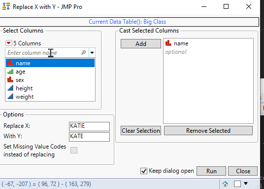

# Replace x with Y
| [Description](#description) | [Usage](#usage) | [Execution](#execution) | [Possible future features](#possible-future-features) |

## Description 
Tool can be used to quickly replace specific value in multiple columns. Also if Y value is left missing ("" or .), setting X values as Missing Value Codes is also possible

## Usage
User casts wanted columns to Col List Selector and then chooses which value to replace and with what. After this user presses Run and values will be replaced

### GUI

### Options
User has access to following options directly from the user interface:
* Set Missing Value Codes instead of replacing
  * Option comes available if Y value is left missing and will change default behaviour from replaceing to setting Missing Value codes column property

## Execution
N/A

## Possible future features
* Add some sort of statistics on how many values were replaced in total / per column